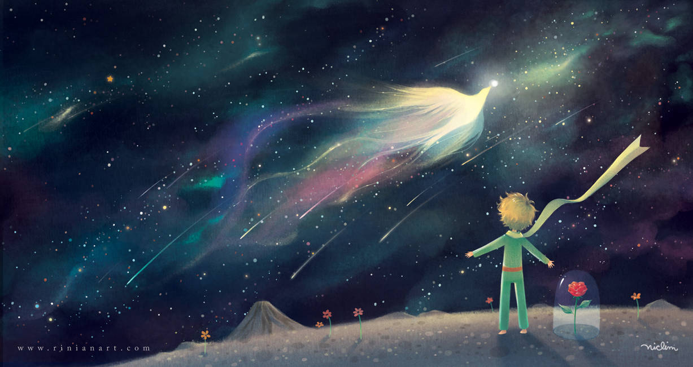

# La Véritable Histoire du Petit Prince

_Source : [Rinian DeviantArt](https://www.deviantart.com/rinian/art/The-Little-Prince-358731292)_

Il était une fois, un petit garçon voué à un destin fabuleux.  
Un jour, il rencontra un vagabond sur une planète nommée Headium.  

Ce vagabond, doté d'une longue barbe blanche et d'une canne dorée, lui expliqua qu'il n'y avait pas d'autres humains sur cette planète. Seul la nature grandissait sur Headium.

Comment pourrait-il survivre seul au milieu de la nature? Le vagabond lui conseilla de ne pas s'inquiéter que tout finirait par s'arranger. Peut-être était-il destiné à conserver la nature de cette planète, tel un gardien? Le vagabond s'en alla sans dire un mot, qui était-il vraiment?

Le petit garçon décida donc d'explorer la planète dont il était le gardien mais il ne savait pas vraiment ce que cela signifiait. En se promenant, il se rendit compte qu'il n'y avait peut être pas d'autres humains mais que la nature y était luxuriante. Tout était magnifique, des animaux aux plantes et que la planète cachait un trésor, une chose qu'il n'avait jamais vu auparavant.

Ce qu'il vit l'étonna énormément, il n'avait jamais vu un crystal aussi pur, le crystal était d'un étrange couleur, un mélange de violet, cyan et rose. Il se demanda à quoi servait ce crystal, car sa taille était si grande qu'il ne savait pas le porter.